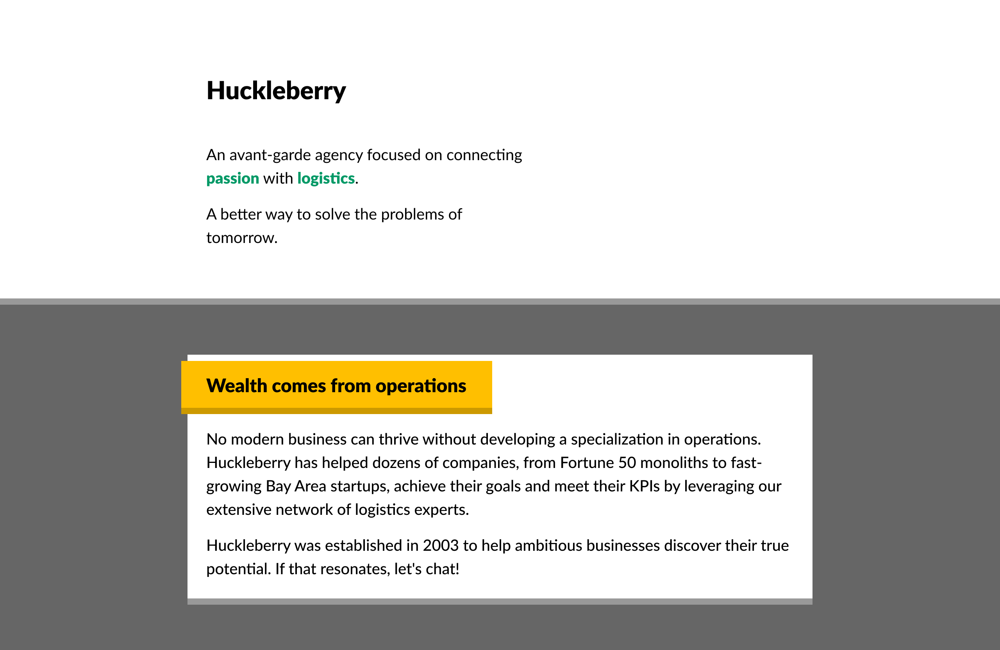
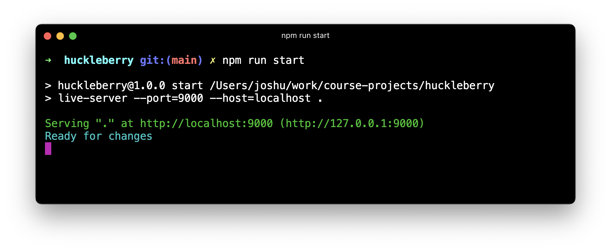
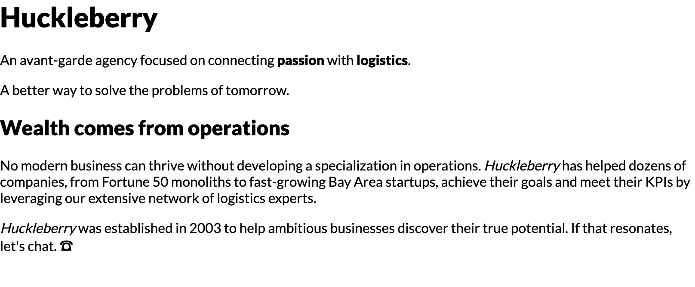

# Huckleberry Agency Website

A minimal landing page for an agency.

This mockup is built entirely using _flow layout_: no Flexbox, no grid, no absolute positioning, no media queries. It relies heavily on padding, margin, and border, as well as some of the tricks I learned in Module 1 of  Josh Comeau's course.



The design is available on Figma:

- https://www.figma.com/file/6hGqKA5scrZJScb9KW3Hj2/Huckleberry

## Setup Instructions

This project uses an NPM package called "live-server" — it provides a basic local file server, so that you can view the HTML file in-browser, and automatically reloads the page when the HTML/CSS changes.

Start by installing dependencies:

```
npm install
```

Run the "start" script to start the server:

```
npm run start
```

You should see a confirmation message like this:



You can visit `http://localhost:9000` to view the page. You should see a bunch of unstyled content:



> **Trouble with this process?**
>
> Because this project is vanilla HTML and CSS, you can always open the HTML file in your browser, without fussing with a local file server.
>
> Certain JS APIs won't work when viewing files in this way, but that isn't a concern for this project.

---

- **Pay close attention to alignment.** For example, you should be able to draw a line along the left, and all text should be neatly aligned:


### Spacing

This app uses an 8px unit. All spaces are a multiple of 8px:

- `8px`
- `16px`
- `24px`
- `32px`
- `48px`
- `64px`
- `96px`
- `128px`

When it comes to max widths (e.g. the maximum width of the card), arbitrary values can be used.

### Font

1 font is used in this project: `Lato`. It is already included in the stylesheet.

For font sizes, the `rem` unit should be used.

The scale is:

- `1rem`
- `1.25rem`
- `1.5rem`
- `2rem`

By default, `1rem` is equivalent to `16px`.

### Color palette

Primary (green):

- `hsl(160deg, 100%, 30%)`

Secondary (gold):

- `hsl(45deg, 100%, 50%)` (lighter)
- `hsl(45deg, 100%, 40%)` (darker)

Grays:

- `hsl(0deg, 0%, 0%)` (black)
- `hsl(0deg, 0%, 10%)` (very dark)
- `hsl(0deg, 0%, 30%)` (dark)
- `hsl(0deg, 0%, 40%)` (medium)
- `hsl(0deg, 0%, 60%)` (light)
- `hsl(0deg, 0%, 100%)` (white)
